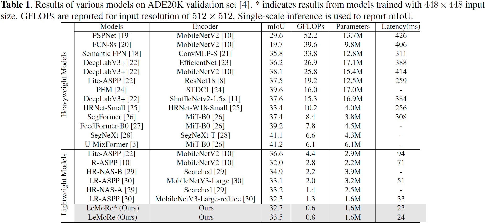
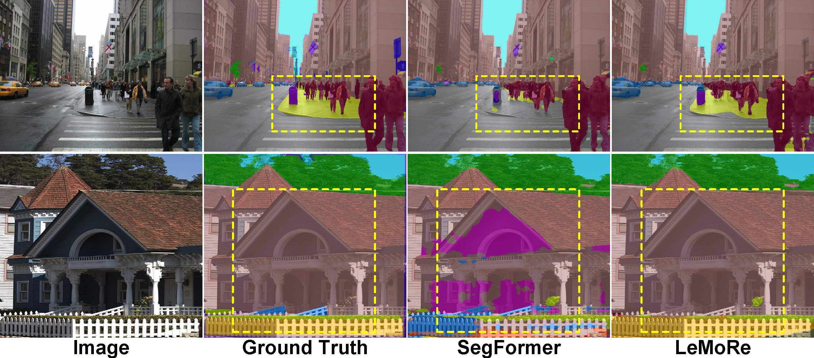

# LeMoRe

**Accepted at IEEE ICIP 2025**

**Paper Title:** LeMoRe: Learn More Details for Lightweight Semantic Segmentation  
**Authors:** Mian Muhammad Naeem Abid, Nancy Mehta, Zongwei Wu, Radu Timofte  
**Conference:** IEEE International Conference on Image Processing (ICIP), 2025  
**Paper Link:** https://arxiv.org/abs/2505.23093


## Abstract

> Lightweight semantic segmentation is essential for many downstream vision tasks. Unfortunately, existing methods often struggle to balance efficiency and performance due to the complexity of feature modeling. Many of these existing approaches are constrained by rigid architectures and implicit representation learning, often characterized by parameter-heavy designs and a reliance on computationally intensive Vision Transformer-based frameworks. In this work, we introduce an efficient paradigm by synergizing explicit and implicit modeling to balance computational efficiency with representational fidelity. Our method combines well-defined Cartesian directions with explicitly modeled views and implicitly inferred intermediate representations, efficiently capturing global dependencies through a  nested attention mechanism. Extensive experiments on challenging datasets, including ADE20K, CityScapes, Pascal Context, and COCO-Stuff, demonstrate that LeMoRe strikes an effective balance between performance and efficiency.


## Method


## Main Results




## Visual Results

<div align="center">

</div>

### More Results
<div align="center">

</div>


## Code

Coming Soon


## Citation
```plaintext
@misc{abid2025lemorelearndetailslightweight,
      title={LeMoRe: Learn More Details for Lightweight Semantic Segmentation}, 
      author={Mian Muhammad Naeem Abid and Nancy Mehta and Zongwei Wu and Radu Timofte},
      year={2025},
      eprint={2505.23093},
      archivePrefix={arXiv},
      primaryClass={cs.CV},
      url={https://arxiv.org/abs/2505.23093}, 
}
